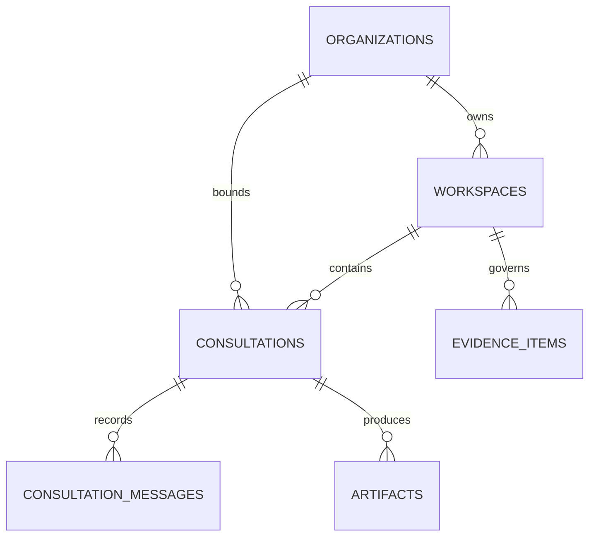

# Operational data model

Status: Initial persistence baseline
Related issues: [#7 Docker platform](https://github.com/Mavkit/AIConsultant/issues/7), [#8 customer workspace](https://github.com/Mavkit/AIConsultant/issues/8)

## Purpose

PostgreSQL is the system of record for tenant identity, workspaces, consultations, evidence metadata, messages, and generated-artifact metadata. Binary documents and artifacts will live in object storage; their database rows retain tenant ownership, classification, provenance, and version references.

## Tenant boundary

Every customer-owned operational table carries `organization_id`. Composite foreign keys require a workspace, consultation, message, evidence item, or artifact to reference a parent from the same organization. Public API handlers must derive organization context from verified identity and membership rather than accept it as authority from request bodies or URLs.

This schema-level integrity is one layer, not complete authorization. Application authorization, database roles, row-level policies, audit events, and adversarial tenant-isolation tests remain required before customer data is admitted.

## Initial relationships

## Migration contract

- Migrations are ordered, immutable SQL files under `infra/postgres/migrations`; the Compose migration command lists them in execution order.
- Every migration runs with `ON_ERROR_STOP=1` and records its version in `schema_migrations`.
- The current foundation migration is idempotent so the Compose migration job can run on every startup.
- Production rollout must run migrations as a controlled one-shot job before application replicas start.
- Destructive or data-rewriting changes require a backup, tested rollback/forward-fix plan, and an explicit ADR.

## Local pilot seed

`infra/postgres/seed/001_local_pilot.sql` creates deterministic, non-customer demo records and is safe to run repeatedly. It exists only to make local journeys and automated tests reproducible. Production deployment must not execute this seed.
