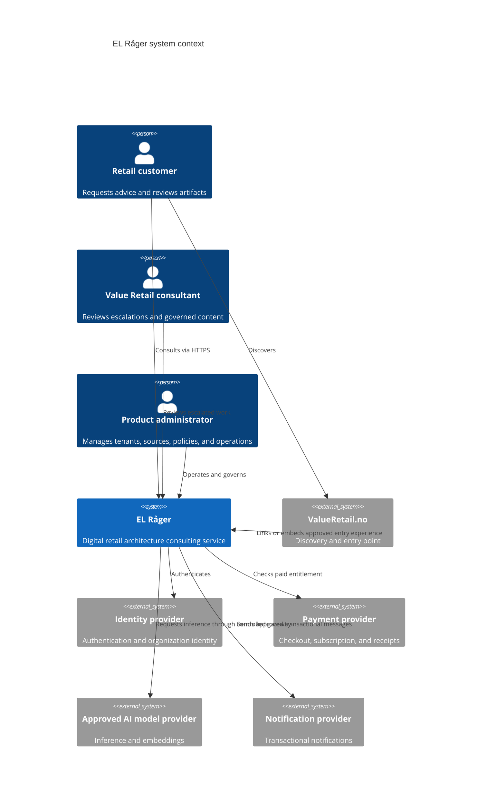
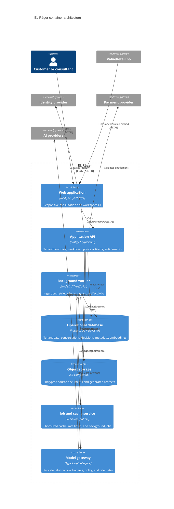

# Platform architecture

Status: Proposed baseline
Milestone: M1 — Foundation & Architecture

## Architecture goals

- Secure multi-tenant handling of customer conversations, documents, and artifacts.
- A responsive web experience reachable from Value Retail's website.
- Docker-based local, test, and production portability.
- Governed knowledge retrieval with provenance and tenant boundaries.
- Replaceable model providers and independently testable consulting logic.
- Observable quality, latency, usage, and cost without unsafe content logging.
- Incremental delivery by a small product team.

## System context



## Container view



## Proposed repository shape

```text
apps/
  web/                 Next.js customer and consultant experience
  api/                 Fastify application and streaming endpoints
  worker/              Background ingestion and artifact jobs
packages/
  contracts/           Versioned schemas and shared API types
  design-system/       Value Retail-aligned UI primitives
  evaluation/          Scenario datasets, rubrics, and runners
docs/
  architecture/        Diagrams and ADRs
  domain/              Retail competency model
  product/             Vision and persona
  workflows/           Consulting workflow specifications
infra/
  docker/              Dockerfiles and runtime support
  deploy/              Environment-specific deployment definitions
```

## Key boundaries

### Web application

Owns rendering, accessibility, localization, and session UX. It does not hold model-provider credentials or directly access databases. ValueRetail.no should link to a dedicated subdomain initially; an embed is allowed only after content security, cookie, accessibility, and navigation behavior are validated.

### Application API

Is the authoritative tenant and authorization boundary. It coordinates consulting workflows, validates entitlements, stores the evidence ledger, and exposes versioned contracts to the web application.

### Consulting core

Domain services inside the API define workflow stages, artifact schemas, source requirements, escalation rules, and policy checks. These services must be testable without a live model.

### Model gateway

All inference and embedding calls pass through one internal interface. It selects approved providers/models, enforces token and monetary budgets, removes prohibited telemetry, records safe usage metadata, and supports deterministic test doubles.

### Knowledge pipeline

Background workers ingest approved sources, attach governance metadata, create embeddings, and publish versioned indexes. Shared and tenant-private sources use explicit scopes enforced both in retrieval filters and storage authorization.

## Tenant and trust boundaries

- Every tenant-owned record includes an immutable tenant identifier.
- Authorization is enforced in application services and database access policies where practical.
- Object keys and retrieval metadata are tenant-scoped; client-supplied tenant identifiers are never trusted alone.
- Background jobs carry a signed or server-generated tenant context.
- Shared knowledge requires explicit approval and cannot be inferred from customer uploads.
- Administrative support access is audited and designed for least privilege.
- Model providers receive only the minimum required context under approved contractual and retention settings.

## Core domain concepts

- **Organization/Tenant** — customer security and billing boundary.
- **Workspace** — bounded engagement or team area.
- **Consultation** — conversational engagement following a workflow.
- **Evidence item** — customer statement or approved source with provenance.
- **Assumption** — unverified input with status and owner.
- **Decision** — option selection with rationale and accountability.
- **Artifact** — versioned generated deliverable.
- **Knowledge source** — governed content and ingestion status.
- **Entitlement** — server-side permission to consume a paid capability.
- **Escalation** — structured request for human involvement.

## API principles

- Contract-first JSON APIs with generated OpenAPI documentation.
- Server-sent events for interactive streaming; durable jobs for long artifacts.
- Idempotency keys for chargeable or job-creating commands.
- Optimistic concurrency for editable artifacts and decisions.
- Stable opaque identifiers; no tenant meaning encoded in public URLs.
- Consistent problem details with safe user messages and internal correlation IDs.

## Quality attributes

| Attribute | Initial architecture response |
| --- | --- |
| Security | Least privilege, tenant enforcement, encryption, secret injection, dependency scanning |
| Privacy | Data classification, minimized prompts, configurable retention, deletion propagation |
| Availability | Stateless web/API replicas, health checks, managed durable stores, graceful degradation |
| Performance | Streaming responses, background artifacts, retrieval budgets, caching of non-sensitive results |
| Scalability | Horizontally scalable stateless services and queue-based workers |
| Portability | OCI containers, open protocols, PostgreSQL, S3-compatible storage, provider interfaces |
| Maintainability | Modular monolith core, explicit contracts, ADRs, automated tests |
| Observability | Correlated traces, safe structured events, quality/latency/cost metrics |
| Accessibility | WCAG-oriented design system and keyboard/screen-reader test coverage |
| Cost | Per-tenant budgets, model routing, usage metering, and asynchronous work controls |

## Deployment environments

- **Local:** Docker Compose with replaceable local/test dependencies.
- **CI:** Ephemeral containers and deterministic model/retrieval test doubles.
- **Staging:** Production-like tenant, identity, model, and payment sandboxes.
- **Production:** Independently scalable containers behind managed TLS ingress, with managed data services preferred.

The platform does not assume a particular cloud in Milestone 1. A deployment-provider ADR will be written when operational constraints and customer data-residency requirements are known.

## Architecture risks and validation spikes

1. Validate tenant-safe retrieval filters under adversarial queries.
2. Measure quality and cost across candidate model providers using retail scenarios.
3. Validate streaming and background artifact UX under realistic latency.
4. Confirm ValueRetail.no integration constraints with the current site owner/CMS.
5. Confirm identity, payment, data residency, retention, and human-review requirements before pilot.
6. Prototype canonical artifact schemas before committing to PDF/DOCX presentation layers.
