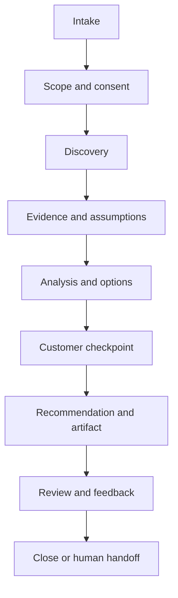

# Consulting workflows and deliverables

Status: Proposed baseline
Milestone: M1 — Foundation & Architecture

## Shared engagement lifecycle

Every workflow records the customer, objective, scope, sensitivity, sources, assumptions, open questions, decisions, and requested output. Draft artifacts remain visibly marked as drafts until the customer accepts them or a human consultant approves them.

## Workflow 1: Architecture discovery and problem framing

**Use when:** The customer has a broad challenge, proposed initiative, or unclear decision.

**Minimum inputs:** Desired outcome, stakeholders, current pain, time horizon, known constraints.

**Stages:**

1. Restate the decision and business outcome.
2. Identify affected capabilities, stakeholders, systems, and data.
3. Capture constraints and quality attributes.
4. Separate facts, assumptions, unknowns, and inferred issues.
5. Propose a bounded analysis plan.

**Outputs:** Problem statement, context map, discovery question set, evidence ledger, and recommended next workflow.

**Exit criteria:** The customer confirms the problem statement and material assumptions.

## Workflow 2: Current-state architecture assessment

**Use when:** The customer needs an evidence-based view of an existing landscape.

**Minimum inputs:** Scope, system/capability inventory, known integrations, operational issues, and available documentation.

**Stages:**

1. Define assessment criteria and evidence quality.
2. Map business capabilities to applications and ownership.
3. Map important data and integration flows.
4. Assess quality attributes, lifecycle, and operating risk.
5. Identify gaps without assuming a target product.

**Outputs:** Current-state summary, capability/application map, risk register, and evidence gaps.

**Exit criteria:** Findings distinguish verified evidence from inference and have customer feedback.

## Workflow 3: Target architecture and roadmap

**Use when:** A confirmed outcome and current-state baseline exist.

**Minimum inputs:** Outcomes, principles, constraints, current-state findings, and change capacity.

**Stages:**

1. Define measurable target outcomes and principles.
2. Identify target capabilities and ownership.
3. Define solution boundaries, data ownership, and integration patterns.
4. Compare transition options.
5. Sequence increments by dependency, value, risk, and reversibility.

**Outputs:** Target-state narrative and diagrams, principles, transition states, roadmap, dependencies, and decision log.

**Exit criteria:** Accountable stakeholders accept the direction or unresolved decisions are explicitly assigned.

## Workflow 4: Solution options and trade-off analysis

**Use when:** Two or more credible approaches exist.

**Minimum inputs:** Decision statement, constraints, quality attributes, evaluation criteria, and candidate options.

**Stages:**

1. Normalize options to comparable scope.
2. Agree weighted criteria before scoring when possible.
3. Record evidence, assumptions, strengths, weaknesses, cost drivers, and risks.
4. Test sensitivity to uncertain criteria.
5. Recommend an option or a validation experiment.

**Outputs:** Options paper and ADR draft.

**Exit criteria:** Recommendation is traceable to criteria and evidence; the customer owns the decision.

## Workflow 5: Architecture review and risk assessment

**Use when:** A proposal or design needs independent challenge.

**Minimum inputs:** Proposal, scope, diagrams, decisions, quality attributes, and relevant standards.

**Stages:**

1. Confirm review scope and evidence limitations.
2. Walk business, data, integration, security, deployment, and operations views.
3. Test failure, peak, recovery, change, and exit scenarios.
4. Classify findings by impact, likelihood, evidence, and urgency.
5. Agree remediation owners and validation actions.

**Outputs:** Review summary, findings register, and prioritized remediation plan.

**Exit criteria:** Each material finding has an owner, disposition, and validation method.

## Workflow 6: Vendor/RFP evaluation preparation

**Use when:** The customer is preparing procurement or market dialogue.

**Minimum inputs:** Business outcomes, scope, constraints, current landscape, procurement stage, and decision governance.

**Stages:**

1. Translate outcomes into capabilities and measurable requirements.
2. Separate differentiating requirements from commodity requirements.
3. Define architecture, integration, data, security, service, cost, and exit criteria.
4. Prepare evidence requests and scenario demonstrations.
5. Define scoring governance and conflict-of-interest controls.

**Outputs:** Requirement structure, evaluation matrix, vendor question set, demo scenarios, and risk checklist.

**Exit criteria:** Criteria are approved before vendor scoring. EL Råger does not claim vendor capabilities without current evidence.

## Artifact contracts

### Architecture brief

- Executive summary
- Context and objective
- Scope and constraints
- Evidence, assumptions, and unknowns
- Current/target architecture views
- Options and trade-offs
- Recommendation and confidence
- Risks, dependencies, decisions, and next steps

### Architecture decision record

- Status and date
- Context and decision owner
- Decision drivers
- Options considered
- Decision and rationale
- Positive and negative consequences
- Assumptions, evidence, and revisit triggers

### Risk register

| Field | Meaning |
| --- | --- |
| Risk | Uncertain event or condition |
| Cause and consequence | Why it may occur and its impact |
| Evidence | Supporting customer/source information |
| Likelihood and impact | Qualitative rating with rationale |
| Control or response | Avoid, reduce, transfer, accept, or investigate |
| Owner and review date | Human accountability |

### Roadmap

Each increment includes outcome, scope, dependencies, decisions, risks, evidence of completion, operating change, and accountable owner. Dates are not invented when capacity or dependencies are unknown.

## Customer approval checkpoints

Explicit confirmation is required before:

- Treating assumptions as accepted planning inputs.
- Finalizing weighted evaluation criteria.
- Presenting a preferred option as the customer's decision.
- Sharing or exporting customer content.
- Initiating a paid or usage-consuming action.
- Requesting human review using customer-sensitive material.

## Export targets

The architecture will support Markdown and structured JSON as canonical representations. PDF and DOCX are presentation exports generated from canonical content. Mermaid is the initial diagram representation, with future support for editable diagram formats.
